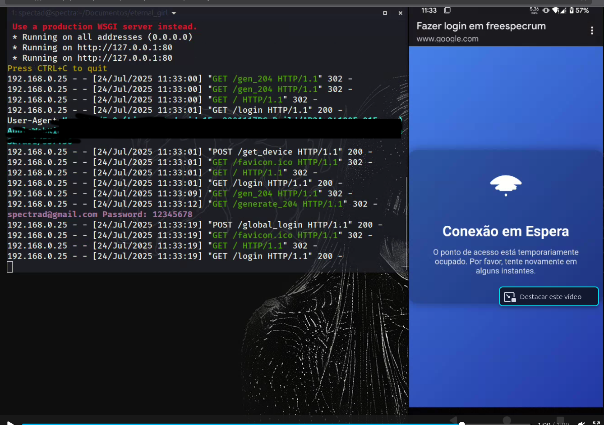
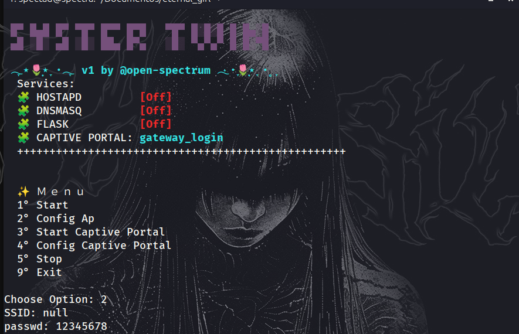
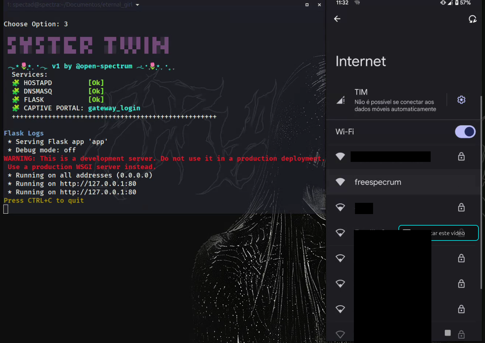
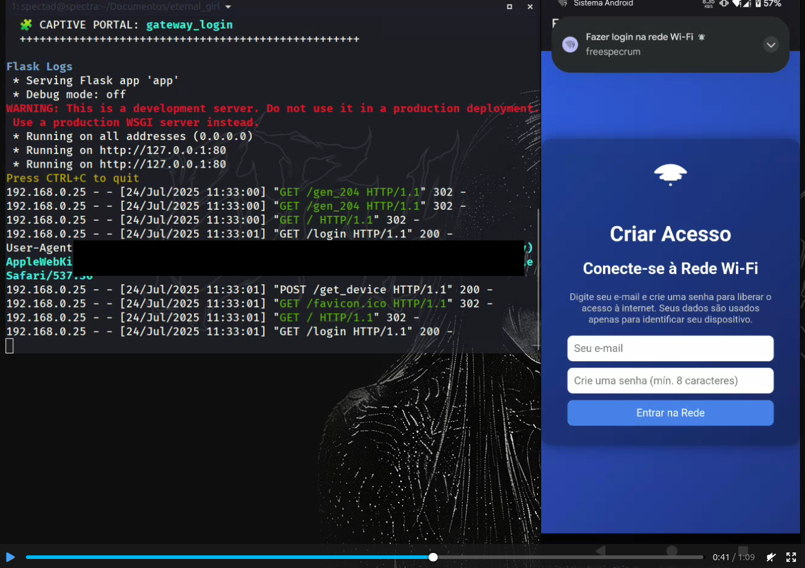

# Sister-Twin

**Sister-Twin** is a generic captive portal built with Python and Flask. It uses `hostapd` to create an access point, `dnsmasq` to handle DHCP and DNS spoofing, and Flask to serve a custom login or redirection page. Ideal for ethical testing, IoT networks, and educational labs.

---

## ✨ Features

- Lightweight and modular captive portal
- Compatible with most systems (Android, iOS, Linux, Windows)
- Automatically intercepts and redirects clients after connection
- Easy to customize (HTML, CSS, JS)

---

## 📸 Screenshots

<div align="center">
  
  <br>
  
  
</div>

---

## ⚙️ Requirements

Install required system packages (Ubuntu/Debian):

```bash
sudo apt update
sudo apt install dnsmasq hostapd python3 python3-venv
```
📦 Installation
Clone the repository:
```bash
git clone https://github.com/open-spectrum/SiterTwin-Generic-Captive-Portal.git
cd SiterTwin-Generic-Captive-Portal
```
Create and activate a Python virtual environment:

```bash
python3 -m venv venv
source venv/bin/activate
pip install flask
```
interface = "your_interface_name"  # e.g. "wlan0"
sudo python3 main.py

⚠️ Disclaimer
This tool is intended for educational and testing purposes only.
Do not deploy on public or unauthorized networks. Always act ethically and within the law.
